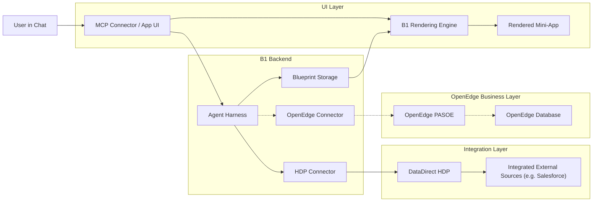

# AI Hackathon Build

This repository contains our Build.One submission for the Progress `OpenEdge x AI Innovation Challenge` in EMEA.

The special hackathon angle of this project is the integration of Progress technologies into a modern AI-driven application flow. In particular, we highlight how `OpenEdge DB`, `OpenEdge PASOE`, and `DataDirect Hybrid Data Pipeline` can participate in a chat-first architecture where AI does not stop at text, but delivers working mini-apps.

## Executive Summary

We are building a system where users solve business tasks through chat, but the result is not a text reply. Instead, Build.One generates and renders a task-specific `mini-app` directly in the conversation.

For the hackathon, the key innovation is the combination of:

- `Build.One` for AI agent orchestration, blueprint generation, and UI rendering
- `Progress OpenEdge Database` as the system of record
- `Progress OpenEdge PASOE` as the business-logic layer
- `Progress DataDirect Hybrid Data Pipeline` as the integration layer

This creates an architecture in which AI can assemble governed enterprise interfaces on demand, while Progress technologies provide the trusted data and service foundation underneath.

## What We Built

`Don't give users another chatbot. Give them the right app, exactly when they need it.`

Our core idea is simple:

Users should not have to jump between many different enterprise tools to complete one job.

Instead of giving the user only a text answer in chat, our system creates a fitting interactive mini-app on demand. The user describes the task in natural language, and Build.One assembles the right interface from governed building blocks and renders it directly in the chat via the MCP App UI protocol.

We call these generated interfaces `mini-apps`.

## Why This Fits The Progress Hackathon

This project is not just an AI interface experiment. It is a practical prototype showing how Progress products can support a modern AI-driven user experience.

The integrations we especially want to highlight are:

- `Progress OpenEdge Database` as a business-critical system of record
- `Progress OpenEdge PASOE` as the application/server layer for business logic and service exposure
- `Progress DataDirect Hybrid Data Pipeline` as the governed integration layer that exposes enterprise data in a consumable way

Our submission shows how these kinds of systems can be connected to an AI-driven frontend experience built with Build.One:

- enterprise data stays in governed systems
- business logic can stay in existing backend/application layers
- AI orchestrates the right interface for the user
- the result is rendered as a mini-app instead of a plain text response

That makes the project relevant to the hackathon: it shows how Progress technology can participate in practical AI workflows instead of being treated as a disconnected backend.

In our architecture, Progress technologies are part of the overall application model rather than separate downstream integrations.

Build.One already supports `OpenEdge Database` and `OpenEdge PASOE` as enterprise building blocks. In this hackathon project, we combine that with MCP-based app rendering and extend it with an AI-created `DataDirect HDP` connector so that additional enterprise sources can participate in the same mini-app architecture.

For a sales manager, this means the workflow can move from:

- open Salesforce
- export data
- switch to BI/dashboard tooling
- filter and compare numbers
- prepare a result for the next action

to:

- ask once in chat
- receive a purpose-built mini-app with live data, filters, and actions
- continue working inside that app immediately

## The Problem

In many organizations, business users still need several systems to answer one operational question. Even when AI is available, it often responds with text only. That still leaves the user responsible for opening the right tools, validating data, and executing the next action manually.

We wanted to show a better pattern:

- chat is the starting point
- the result is not just text
- AI generates the right UI for the task
- the interface can contain real enterprise data and real actions

## Our Approach: Mini-Apps Instead of Chat Replies

In this project, we use a `mini-apps, not chat replies` approach. In practice, that means:

- the user formulates the need in plain language
- the system identifies the right data, UI components, and actions
- Build.One assembles a small application for exactly that task
- the mini-app is rendered directly in the conversation
- the user can interact with the result instead of reading a long answer and doing the rest manually

This is especially useful for roles like sales managers, operations leads, or analysts who often need focused workflows rather than generic chat responses.

## Innovation Highlights

- `Mini-apps instead of chat replies`
  - AI does not stop at explanation. It delivers a working interface for the task.
- `Progress-based enterprise architecture`
  - OpenEdge, PASOE, and DataDirect are integrated into the architecture described in this submission.
- `AI-assisted micro-connectors`
  - New target systems can be connected through small, focused connectors that share one Build.One-side contract.

## Integration Approach

Our implementation strategy is based on a shared abstraction layer:

- Build.One uses `Blueprints` as the common application language
- connectors understand a shared Build.One-style data access model
- each connector translates that model at runtime into the target system's native access pattern

In practical terms, that means:

- the generated mini-app does not need to know whether its data comes from `OpenEdge`, `PASOE`, or `DataDirect HDP`
- the Build.One agent can generate a blueprint that references governed data objects and screens, including data sources backed by `HDP`
- for `DataDirect HDP`, the agent creates a focused micro-connector that understands the Build.One-side query model and translates it into `OData`
- the runtime resolves those objects through the correct connector path, for example through the `HDP` micro-connector when the mini-app needs integrated external data
- each target integration translates standard concepts like query, filter, and paging into the source-specific protocol; in the current prototype, this translation is implemented explicitly for `HDP`

This gives us a flexible architecture in which enterprise systems stay specialized, while the app-generation layer stays consistent.

## Current Prototype Scope

The current prototype demonstrates this concept with a Salesforce opportunities use case exposed through `DataDirect HDP`.

Today, the implemented flow includes:

- a Build.One app module for the hackathon product
- a custom HDP OData connector in the Node.js backend
- a Salesforce Opportunities data source wired into Build.One
- a generated search/screen flow for browsing opportunity data
- a grid with key sales fields like name, amount, close date, stage, and probability
- an AI agent object in the Build.One repository as a foundation for richer assistant workflows

So while the broader vision is dynamic mini-app generation inside chat, the current repo already proves the most important foundation:

- enterprise data can be connected
- data can be exposed through governed objects
- Build.One can render an application surface for the task
- this pattern is ready to evolve into richer chat-native mini-app workflows

From a Progress perspective, the currently visible implementation especially emphasizes the `DataDirect Hybrid Data Pipeline` integration pattern. `OpenEdge` and `PASOE` are the intended system-of-record and business-logic layers in the broader architecture, while the live repo implementation currently demonstrates the connector and mini-app pattern through `HDP` and the Opportunities flow.

## Demo Story

A strong walkthrough is:

1. Start with the user problem: a sales manager wants to inspect pipeline data without jumping across systems
2. Explain that the chat is only the entry point, not the final result
3. Show the generated mini-app experience
4. Walk through the Opportunities screen as the concrete prototype
5. Explain how the same mechanism can support further use cases, data sources, and actions

## Architecture

This repository is a Yarn workspace monorepo with three main parts:

### `src/app-server-ts`

Node.js backend with:

- custom HDP connector (`hdp`)
- Build.One API/Core modules
- server action support for future extensions

The connector currently targets:

- base URL: `HDP_API_BASE_URL` or `https://hdp.test.build.one`
- dataset: `api/odata4/hackathon_salesforce`
- resource: `OPPORTUNITIES`

### `src/data`

Build.One repository objects and application metadata, including:

- the hackathon product definition
- menu and navigation configuration
- the Opportunities data source object
- the Opportunities screen and grid definitions
- the AI agent configuration object

### `src/web-app`

Nuxt-based frontend extending the Build.One web framework layer.

The current UI is mostly driven by Build.One configuration from `src/data`, which keeps the presentation layer declarative and allows app surfaces to be assembled from reusable building blocks.

## Core Architecture

The core architecture combines four major layers:

- `Build.One Framework`
  - AI agent harness
  - blueprint datastore
  - rendering engine
- `Progress OpenEdge Database`
  - system of record
- `Progress OpenEdge PASOE`
  - application and business logic layer
- `Progress DataDirect Hybrid Data Pipeline`
  - data integration layer

Together, these layers support a workflow in which AI does not just answer with text, but can generate a governed mini-app that queries enterprise systems and renders an interactive result.

## Architecture Diagram



Solid arrows show the currently visible implementation path in this repository, centered on mini-app rendering and the `HDP` connector flow. Dashed arrows indicate the broader target architecture around `OpenEdge` and `PASOE`.

## End-to-End Architecture

The architecture can be understood as a layered flow:

1. The user starts in chat and describes a business task in natural language
2. The Build.One agent determines which governed building blocks should be used
3. The agent generates a `Blueprint` describing the mini-app
4. The backend fetches the required enterprise data through approved connectors and services
5. Build.One composes the right UI surface for the task
6. The resulting mini-app is rendered directly in the conversation via the MCP App UI protocol

In the current prototype, that flow looks like this:

```text
User in Chat
  -> AI request / intent
  -> Build.One agent harness
  -> generated Blueprint
  -> Build.One repository objects (screens, menus, data-source objects, agent config)
  -> Node.js backend connector layer
  -> DataDirect Hybrid Data Pipeline (OData)
  -> enterprise data source
  -> Build.One mini-app rendered back into the chat
```

In the broader target architecture for Progress-based enterprise environments, the same pattern extends naturally:

```text
Chat / AI Assistant
  -> Build.One agent harness
  -> generated Blueprint
  -> PASOE / backend services for business logic
  -> OpenEdge database as system of record
  -> DataDirect / integration services for governed access to additional systems
  -> interactive mini-app rendered in chat
```

This is the architectural point we want to make in the hackathon:

- AI is the orchestration layer
- Build.One provides the agent harness, blueprint datastore, and rendering engine
- Progress products provide trusted enterprise data and logic layers
- connectors translate between Build.One blueprint semantics and target-system protocols at runtime
- Build.One turns the result into an actionable interface
- MCP App UI makes that interface appear directly inside the conversation

## AI-Created Micro-Connectors

One of the central ideas in this project is the concept of AI-assisted micro-connectors.

Instead of building one large, rigid integration layer, the Build.One agent can create focused connectors for specific target systems. These connectors all understand the same Build.One-side contract, for example:

- query structure
- filter structure
- paging semantics
- data access conventions

At runtime, each micro-connector translates this shared contract into the target system's native format.

In the current prototype, this is demonstrated through the `HDP` connector:

- it was created with the `Build.One Agent Harness`
- `Claude Code` was used as the LLM-assisted engineering workflow
- the connector communicates with `DataDirect HDP` via `OData`
- the connector translates Build.One query objects into HDP-compatible requests

This means the application layer stays consistent even while the connected enterprise systems differ underneath.

## Runtime Decision Logic

When a user asks for a mini-app, the Build.One agent decides which enterprise systems should contribute to the generated blueprint.

In the target model:

- if the task requires core transactional or master data, the agent can use `OpenEdge`
- if the task requires existing application logic, the agent can use `PASOE`
- if the task requires integrated or externally exposed business data, the agent can use `DataDirect HDP`

The generated blueprint then references the appropriate data sources and UI objects. When the app is rendered in B1 Chat, the runtime automatically resolves the required connectors and translates the interactions to and from the relevant systems.

## Tech Stack

The project combines an AI interaction model with a modern full-stack application architecture.

### Frontend

- `Nuxt 3/4`
- `Vue 3`
- `@buildone/web-framework-layer`
- `@buildone/web-framework`
- `@buildone/web-core`
- `PrimeVue`

### Backend

- `Node.js`
- `TypeScript`
- `Axios` for connector HTTP access
- `@buildone/app-server-tslib`

### Data & Integration

- `Progress DataDirect Hybrid Data Pipeline` via OData
- `Progress OpenEdge Database` as the system-of-record layer
- `Progress OpenEdge PASOE` as the business-logic and application-service layer

### AI / App Composition

- chat-first workflow
- Build.One AI agent harness
- Build.One blueprint datastore
- Build.One rendering engine
- Build.One object model for governed app generation
- mini-app rendering through the `MCP App UI` approach
- AI agent object as a foundation for future assistant-driven orchestration

## Key Technical Highlights

- Build.One used as the governed application runtime and composition layer
- chat-first interaction model with app generation as the result
- mini-app rendering concept aligned with the MCP App UI protocol
- Progress-oriented enterprise integration story centered on OpenEdge, PASOE, and DataDirect Hybrid Data Pipeline
- Node.js used for backend integration logic
- OData query translation implemented for connector-based filtering, sorting, paging, and search
- declarative screen composition used to expose business data quickly
- AI agent object already included as a foundation for follow-up assistant capabilities

## Why Build.One

Build.One gives us the building blocks for this hackathon contribution: an agent harness, a blueprint-oriented application model, and a rendering layer for mini-app experiences. In this project, that provides a practical foundation for combining OpenEdge-focused enterprise architecture with a modern agentic UX instead of treating AI as a separate side experience.

## Repository Structure

```text
.
|-- src/
|   |-- app-server-ts/   # Node.js backend, connector, schema, server actions
|   |-- data/            # Build.One product and repository object definitions
|   `-- web-app/         # Nuxt frontend extending the Build.One framework layer
|-- package.json
`-- README.md
```

## Getting Started

### Prerequisites

- Node.js compatible with the workspace setup
- Yarn 4
- Access to the required Build.One packages

### Environment

The backend expects environment variables such as:

- `APP_DATABASE_URL`
- `SECHUB_TOKEN`
- `HDP_API_BASE_URL`
- `HDP_USERNAME`
- `HDP_PASSWORD`

Depending on your environment, additional Build.One and Codespaces secrets may also be required.

### Install

```bash
yarn install
```

### Run the backend

```bash
cd src/app-server-ts
yarn start:dev
```

### Run the frontend

```bash
cd src/web-app
yarn dev
```

## Development Notes

- the backend connector is intentionally read-only for the current prototype
- the repository still contains starter/template elements from the original Build.One base project
- the hackathon-specific implementation currently centers on the Opportunities use case
- the included AI agent object is a foundation piece and not yet the main surfaced chat experience

## Known Issues / Limitations

- `No end-user authorization yet for MCP app tools`
  - The current prototype uses a hard-coded user context instead of propagating the identity of the actual user who created the mini-app.
- `HDP credentials are installation-level configuration`
  - The HDP user is currently provided through environment variables, which means it can only be changed through deployment or installation configuration.
- `HDP test data source does not adapt to the active end user`
  - The user behind the current HDP-backed Salesforce test source is fixed in HDP itself and is not dynamically aligned with the person currently creating or using the mini-app.
- `User-context propagation across the full stack is not finished`
  - In the current prototype, identity and permission propagation across chat, generated blueprint, connector runtime, and downstream systems is not yet implemented end to end.
- `Current showcase scope is intentionally narrow`
  - The repo currently demonstrates the concept mainly through the Opportunities use case and one HDP-based connector path rather than a broad production-ready app portfolio.

## What We Would Build Next

Given more time, the next logical steps would be:

- generate mini-apps dynamically from chat requests instead of focusing on a single prepared showcase flow
- add more Salesforce and cross-system entities beyond Opportunities
- expand the library of AI-generated micro-connectors for additional enterprise systems
- let the AI agent maintain connectors continuously as source systems evolve
- give the agent its own release-monitoring workflow, for example via a dedicated email identity that receives release notes and checks whether connector changes are required
- surface AI actions directly in the user flow
- add summaries, recommendations, and next-best-action support for sales teams
- enable write-back scenarios and guided workflows
- pin, share, and reopen generated mini-apps across sessions and teams

## Team

Built for the Progress Software AI Hackathon by the Build.One team.

If you want, you can replace this line with the names of the team members before submission.

## License

MIT
